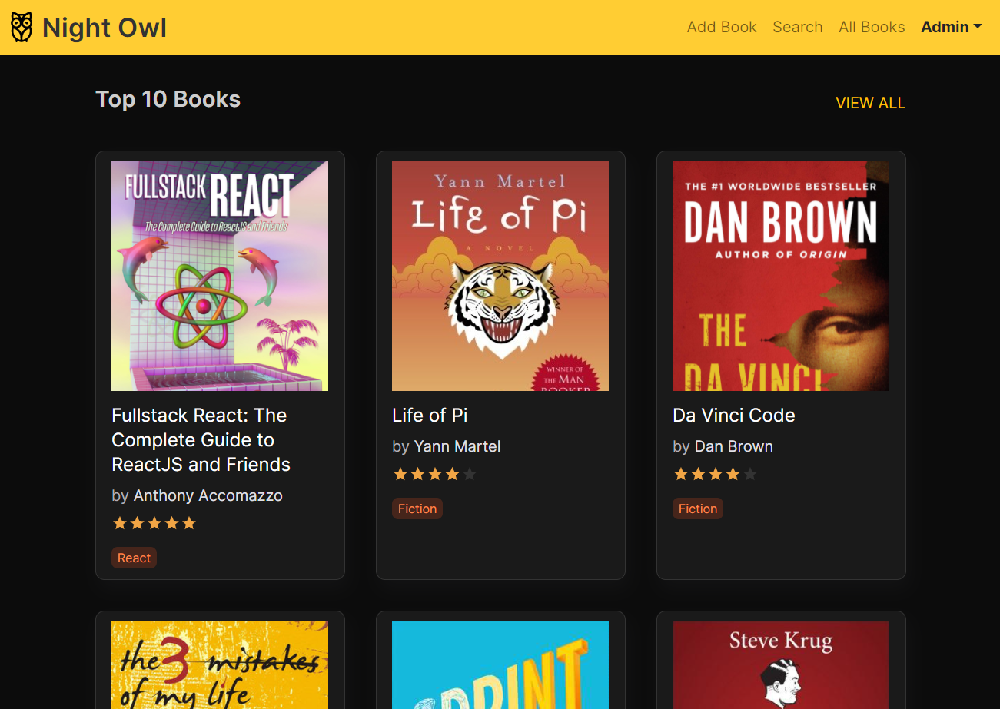
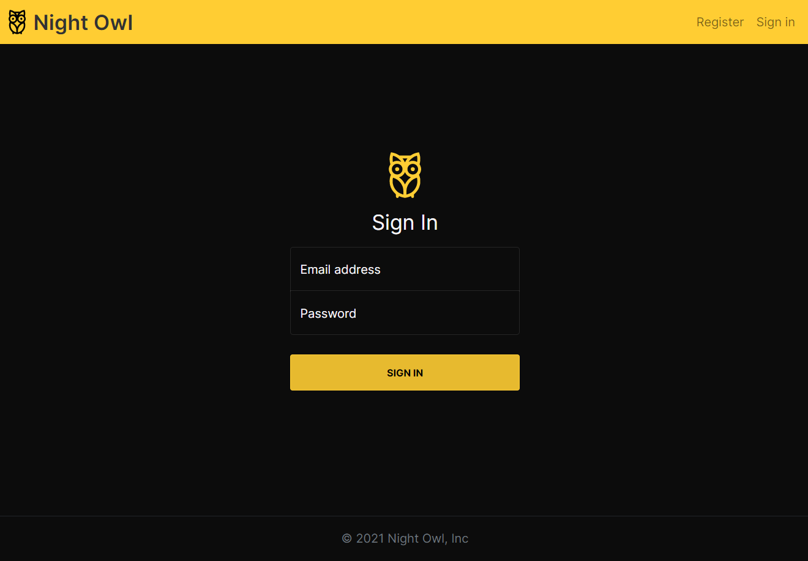
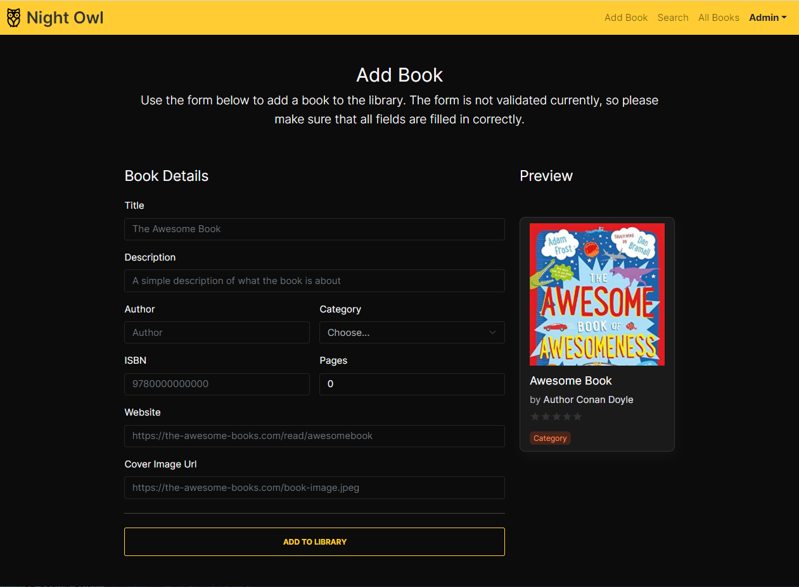
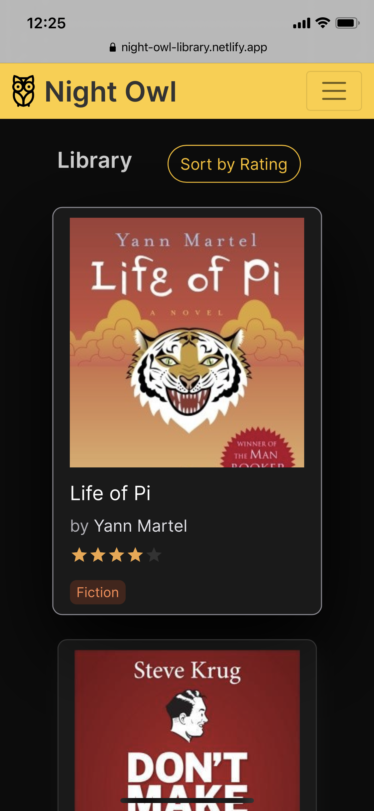
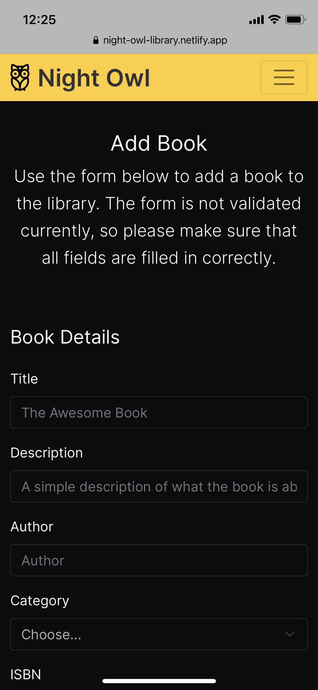

# Night Owl Bookstall App (Completed)

An online book hub for selecting, recommending, managing and reading books.

🚀 UI App: https://night-owl-library.netlify.app

💬 Server APIs: https://night-owl-api.herokuapp.com

Admin login: admin@nightowl.com / admin

## Introduction

This app is created as part of the UI.Focus AERN Challenge @ [Micro Focus](https://www.microfocus.com/). A big thank you to the team for the workshop on Node.js and React and for the opportunity to learn hands on with a challenging implementation.

## Features Implemented

Overall requirement is to build an online book hub for selecting, recommending, managing and reading books.

`List`: The user is able to view the books in the library. The book should have the following details:

- **Title**: Name of the book
- **Category**: The category such as Fiction, Philosophy, etc.
- **Author**: Name of the author
- **Description**: What the book is about
- **Rating**: Average ratings received from users, out of 5.

> Thanks to the UI.Focus team for providing this base implementation :) Some of the design/assets used here has been ripped off from the [demo](https://booklist-ui-focus.netlify.app/) that was shared.

The All Books page lists all books in the system.

`Dashboard`: The initial landing page displays the list of top books in the system.

- The first section displays the **top 10 books**.
- The subsequent sections display the list of Authors and the Categories along with the number of books in each. The user can **filter by Author or Category** using this page.



`Sorting`: User is able to view the latest books as well as the best rated books.

- The initial list in the All Books page is **sorted based on date** that the book was added to the system.
- User can **sort based on user ratings** also.

`Search`: A seach page is provided where the user can **search for book by title**.

`Ratings`: Users can view the avergae rating as well as **add their own rating** (click on the rating stars in the book details page). A user can only add one rating per book.

`Authentication & Authorization`: The system allows only authenticated users to view the library. This is achieved with the **Sign Up** and **Sign In** screens.



System recognizes **two roles**:

- **Users** - can view books and add ratings. Any newly registered user is assigned this role.
- **Admin** - can do everything a user can and also add books to the backend. Admin currently can only be added at request from the backend.

Authentication is implemented with basic bearer token. When the login endpoint is called, and the user's email and password are verified, a jwt token is returned which is sent in subsequent requests. The response also contains the user roles. The password is hashed and stored in the database.

Only the POST APIs are authenticated in the server.

`Add Books`: Users with ADMIN privileges are allowed to create books in the system.



`Extensibility`: Components have been reused wherever possible. For ex. the 'Card' and the 'SectionHeader' are re-used in multiple areas of the application.

`Additional Features`: Book Recommendation added - nothing fancy, just displays the rest of the books in the category.


`Responsive UI`: The UI works on both desktop and mobile - bootstrap is used for this.

<p float="left">
  
  
   
</p>

## To do items

- Edit and Delete Book
- Add Categories
- Lots of refactoring :)

## Installation

### Stack

1. Node.js
2. HarperDB
3. React.js

### 1. HarperDB Setup

The app uses HarperDB as the database. To set up HarperDB, go to [HarperDB Studio](https://studio.harperdb.io/) and follow the instructions [here](https://harperdb.io/docs/harperdb-studio/) to create a new cloud instance. Note down the instance url, username and password. Create a `bookstall` schema and create following tables with given "hash attr.".

- books - `id`
- categories - `id`
- ratings - `id`
- users - `email`

### 2. Node.js Server

```
$ cd server
$ npm install
```

#### Enviroment variables

Rename `.env.example` to `.env` and fill in the params with parameters from the previous step.

#### Run Server

```
$ npm start
```

Attached [Postman script](./docs/night-owl-apis.postman_collection.json) can be used to test the apis.

### 3. React Webapp

```
$ npm install
```

Go to webapp/src/constants/index.js and uncomment line number 2, which lets it connect to the local backend server.

```
$ npm start
```

This should start up the app and open the browser to [http://localhost:3000/](http://localhost:3000/)
